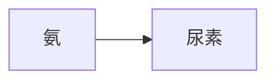

# Anki ↔ Markdown 往返工具：使用说明

## 已有 `.apkg` 反向导出

1. 双击 `run.bat`（或运行 `python markdown_to_anki.py`），在同一窗口使用“Anki → Markdown”。
2. 选择 `.apkg`；程序会在旁边创建同名文件夹，里面按章节保存 `cards.md` 和 `media`。
3. 修改 Front、Back、OriginalMaterial 或媒体，但不要改动每张卡顶部的 `anki-guid`、`anki-model-id`、`anki-tags`、`anki-raw-html`，也不要删除根目录的 `.anki-roundtrip.json`。
4. 再运行 `markdown_to_anki.py`，选择整个导出文件夹并生成 `.apkg`。

反向导出会把 `Ch.1` 至 `Ch.9` 文件夹命名为 `Ch.01` 至 `Ch.09`，避免按名称排序时出现 `Ch.10` 排在 `Ch.2` 前面。Anki 内部的原牌组名仍由元数据保留。

`anki-guid` 保存的是原包中的精确笔记 GUID，因此修改正文后重新封装不会改变卡片身份。数字 note/card ID 是 Anki 用户资料内部编号，标准 `.apkg` 往返不保证它们不变。

导出的正文默认是 Markdown 文件中的原生 HTML，以便不失真地保留表格、图片和样式。保留 `anki-raw-html` 时请继续用 HTML 修改正文；若想改用普通 Markdown 语法，可以删除对应卡片的 `anki-raw-html`，这不会改变 GUID，但字段会经过一次 Markdown → HTML 重新渲染。

## 1. 安装与启动

需要 Python 3.10 或更高版本。在本工具目录打开终端，运行：

```powershell
python -m pip install -r requirements.txt
python markdown_to_anki.py
```

Windows 也可以直接双击 `run.bat`。

## 2. 推荐的牌组文件夹结构

假设主文件夹名为 `Biochemistry`：

```text
Biochemistry/
├─ Chapter01_蛋白质/
│  ├─ cards.md
│  └─ media/
│     ├─ amino_acid.png
│     └─ peptide_bond.png
├─ Chapter02_酶/
│  ├─ kinetics.md
│  ├─ inhibition.md
│  └─ media/
│     └─ michaelis_menten.png
└─ Chapter03_代谢/
   └─ Section01_糖酵解/
      ├─ glycolysis.md
      └─ media/
         └─ glycolysis.png
```

在界面中点击“选择牌组文件夹”，选择 `Biochemistry`。生成后对应关系为：

```text
Biochemistry
├─ Chapter01_蛋白质
├─ Chapter02_酶
└─ Chapter03_代谢
   └─ Section01_糖酵解
```

也就是 Anki 中的 `Biochemistry::Chapter01_蛋白质`、`Biochemistry::Chapter03_代谢::Section01_糖酵解`。输出文件为 `Biochemistry/Biochemistry.apkg`。

如果只选择单个 Markdown，则生成同名牌组和同目录下的同名 `.apkg`。

## 3. 卡片格式与稳定 ID

推荐为每张卡片添加一个永久且全牌组唯一的 `anki-id`：

````markdown
<!-- anki-id: biochem-urea-cycle-001 -->
### Front
尿素循环的主要作用是什么？

### Back
将有毒的氨转化为相对无毒的<mark>尿素</mark>。




---
````

`anki-id` 可以使用英文字母、数字、点、下划线、冒号和连字符，例如 `bio.ch01-card-001`。不要把同一个 ID 用在两张卡片上。

- 有显式 `anki-id`：以后修改 Front、Back，甚至移动 Markdown 文件，卡片 ID 仍保持不变，重新导入会更新原卡片。
- 没有显式 `anki-id`：文件夹模式使用“Markdown 相对路径 + Front 内容”生成稳定 ID；单文件模式继续使用旧版的“牌组名 + Front”算法，保证升级工具后原卡片仍可更新。可以安全补充 Back，但修改 Front、重命名或移动 Markdown 文件可能被 Anki 当作新卡片。
- 新增卡片时请使用新的 `anki-id`。不要修改已有卡片的 `anki-id`。

模型 ID、牌组 ID 和卡片 GUID 都采用固定或确定性生成方式，因此使用同一套目录与 ID 重复生成时保持一致。

## 4. 图片放在哪里

每个 Markdown 使用它所在目录中的 `media` 文件夹。比如：

```text
Chapter02_酶/
├─ kinetics.md
└─ media/
   └─ curve.png
```

在 `kinetics.md` 中写：

```markdown

```

也支持 `/media/curve.png`。图片不存在时，程序会输出警告、跳过该图片并继续生成。不同 Chapter 中可以使用相同图片文件名；打包时程序会自动为冲突文件生成稳定的新名称，不会互相覆盖。

## 5. 支持的内容

- Markdown 加粗、列表、表格、普通代码块
- 原生 HTML，例如 `<mark>重点</mark>`
- Anki MathJax：行内 `\(...\)`，块级 `\[...\]`
- Mermaid：使用 ` ```mermaid ` 围栏代码块
- 标准 Markdown 图片语法

卡片采用参考项目的 Apple 风格：圆角白色内容区、清晰的正反面层级、表格和代码样式、黄色重点标记、图片最大宽度 90%，并支持 Anki 夜间模式。Mermaid 通过指定 CDN 加载，查看流程图时需要网络连接。

## 6. NotebookLM 图片提示词

将图片规则写成：

> 图片：如需配图，请输出 ``，不需要则留空。

之后按引用的文件名准备本地图片，并放入对应 Markdown 同级的 `media` 文件夹。
